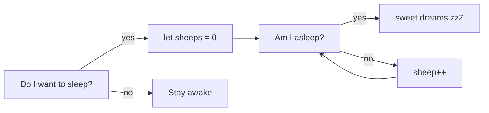

<h1 align="center">🌟 Marina González Suárez – Software Engineer</h1>

🧠 Curiosa, 🧩 autodidacta, 👩‍💻 full-stack web developer, y 💬 comunicadora nata.

---

## 🌱 Sobre mí

- 💼 Soy **Software Engineer** en una **consultora multinacional**, donde desarrollo con **Angular 20 en el frontend**.  
- 🚀 Mi **siguiente paso profesional** es crecer como **Team Lead**, consolidando habilidades de liderazgo, mentoring y organización de equipos.  
- 🎯 A medio plazo, quiero avanzar hacia el rol de **Arquitecta de Software**, diseñando soluciones escalables y sostenibles.  
- 🤝 Me encanta el trabajo en equipo: doy apoyo, mantengo el buen humor y disfruto compartiendo conocimiento con tutoriales prácticos.  
- 👁‍🗨 Desarrollo interfaces **accesibles, rápidas y mantenibles**, siguiendo buenas prácticas.  

---

## 📊 Estadísticas básicas

---

## 🏆 Lenguajes más usados

---

## 🔥 Racha de commits

---

## 🏆 Premios

### Finalista Hackathon Full-Stack · Julio 2022 – Factoría F5

| Front End                                       | Back End                                                | Figma                                                                                     | Equipo                                                                                                                                                                                                                                                                                                                                              |
| ----------------------------------------------- | ------------------------------------------------------- | ----------------------------------------------------------------------------------------- | --------------------------------------------------------------------------------------------------------------------------------------------------------------------------------------------------------------------------------------------------------------------------------------------------------------------------------------------------- |
| [Repo](https://github.com/Yelose/hackathon2022) | [Repo](https://github.com/Yelose/hackathon2022-backend) | [Figma](https://www.figma.com/file/YAx91pA7TXsx38eBbMk90v/PETS-Marketplace?node-id=0%3A1) | [Adrián](https://github.com/adrianmoratilla), [Jesús](https://github.com/checkmyprojects), [Jordi](https://github.com/JordiGDavant), [María](https://github.com/MariangelicaCarvallo), [Mario](https://github.com/marioastur), [Marina](https://github.com/Yelose), [Sara](https://github.com/Saracode13), [Taoufik](https://github.com/taoufikL12) |

🎓 Ver diploma

 

---

## 🎓 Formación

* **Bootcamp Full Stack – Factoría F5 (850h.)**
* **Diseño web avanzado: HTML5, CSS3, JS – Carval Formación (300h.)**
* **Angular Material (6h.)**
* **Marketing Online (30h.)**
* **Responsive Real World Websites (12h.)**

📄 Ver Diplomas

* 
* 
* 
* 

---

## 🛠 Herramientas que uso

| Front End | Back End | Design & Organization | 
| :---:  |  :---:  |  :---: |
|                |          |        |

---

## 🎮 Mini proyectos

* 🎲 [Dice game JS local multiplayer](https://github.com/Yelose/dice150)
* 🧰 [Ejercicios Bootcamp F5](https://yelose.github.io/f5exercises/)

---

## 💬 Contacto

📧 [marina@yelose.dev](mailto:marina@yelose.dev)

---

## 📍 Localización

Asturias (Spain)

---

## 💤 Bonus Flowchart

