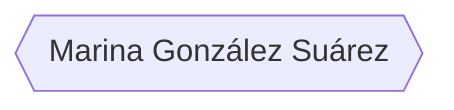
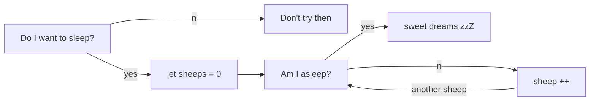

### Hi there 👋
🌱 I'm a junior **full-stack developer**, training in Factoria F5.  
🏆 **Finalist** in Hackaton July-2022, Factoria F5.  
😎 I really love this job, learning and creating new things every day, looking for information, brain storming, and team work.  
👥 Im an empath person, I love interacting with people, everywhere I work I adapt and carry out activities based on the needs the people express.  
🦸‍♀️ I handle changes with ease. 
⚡ Paying attention, showing curiosity, having motivation, being determined, sticking to it, participating, and having initiative are some of my valuable skills. 
 

Sleeping flowchart

    

    

  
