```mermaid
flowchart LR
    id1{{"#8195;#8195; #3899;#8195; #3207;#8195; #3572;#8195;  #8499;arina #667;onzález #1359;uárez #8195;#3572;#8195; #3207;#8195; #3898; #8195;#8195;"}}
```

🌱 I'm a junior **full-stack developer**, training in Factoria F5. <br>
🏆 **Finalist** in Hackaton July-2022, Factoria F5. <br>
😎 I really love this job, learning and creating new things every day, looking for information, brain storming, and team work. <br>
👥 I am an empath person, I love interacting with people, everywhere I work I adapt and carry out activities based on the needs the people express. <br>
🦸‍♀️ I handle changes with ease.<br>
⚡ Paying attention, showing curiosity, having motivation, being determined, sticking to it, participating, and having initiative are some of my valuable skills.<br>
<br>

<details><summary>Personal projects</summary>

   * Right in the beginning of the bootcamp I thought about making a simple website where I insert my [exercises](https://yelose.github.io/f5exercises/)      
   * Learning JS, I just felt like making a simple [2 players local game](https://github.com/Yelose/dice150) wich actually helped me to understand JavaScript

</details>

### 🛠 Tools I work with

| Front End | Back End | Design & organization |
| :---:  |  :---:  |  :---: |
|  [](https://angular.io/) [](https://vuejs.org/guide/introduction.html) [](https://code.visualstudio.com/) [](https://sass-lang.com/documentation/)  [](https://git-scm.com)  [](https://github.com/) [](https://getbootstrap.com/)  [](https://www.w3schools.com/js) [](https://www.w3schools.com/cssref/) [](https://www.w3schools.com/html)   | [](https://www.php.net/)  [](https://dev.mysql.com/)  [](https://nodejs.org)   | [](https://www.gimp.org/)  [](https://www.figma.com/)  [](https://www.gitkraken.com/)  |


<details><summary>Front End Skills</summary>


</details>

<details><summary>Sleeping flowchart</summary>
    

    
</details>  


```topojson
{
  "type": "Topology",
  "transform": {
    "scale": [0.0005000500050005, 0.00010001000100010001],
    "translate": [100, 0]
  },
  "objects": {
    "example": {
      "type": "GeometryCollection",
      "geometries": [
        {
          "type": "Point",
          "properties": {"prop0": "value0"},
          "coordinates": [	43.286794, -5.637294]
        },
        {
          "type": "LineString",
          "properties": {"prop0": "value0", "prop1": 0},
          "arcs": [0]
        },
        {
          "type": "Polygon",
          "properties": {"prop0": "value0",
            "prop1": {"this": "that"}
          },
          "arcs": [[1]]
        }
      ]
    }
  },
  "arcs": [[[4000, 0], [1999, 9999], [2000, -9999], [2000, 9999]],[[0, 0], [0, 9999], [2000, 0], [0, -9999], [-2000, 0]]]
}
```
