```mermaid
flowchart LR
    id1{{"#8195;#8195; #3899;#8195; #3207;#8195; #3572;#8195;  #8499;arina #667;onzález #1359;uárez #8195;#3572;#8195; #3207;#8195; #3898; #8195;#8195;"}}
```

### Hi there 👋
🌱 I'm a junior **full-stack developer**, training in Factoria F5.  
🆠**Finalist** in Hackaton July-2022, Factoria F5.  
😠I really love this job, learning and creating new things every day, looking for information, brain storming, and team work.  
👥 I am an empath person, I love interacting with people, everywhere I work I adapt and carry out activities based on the needs the people express.  
🦸‍♀️ I handle changes with ease. 
⚡ Paying attention, showing curiosity, having motivation, being determined, sticking to it, participating, and having initiative are some of my valuable skills. 
 

Personal projects

   * Right in the beginning of the bootcamp I thought about making a simple website where I insert my [exercises](https://yelose.github.io/f5exercises/)      
   * Learning JS, I just felt like making a simple [2 players local game](https://github.com/Yelose/dice150) wich actually helped me to understand JavaScript

# Skills

    

| Front End | Back End | Design & organization |
| :---:  |  :---:  |  :---: |
|    |      |      |

Front End Skills

Sleeping flowchart

    

    

  
