```mermaid
flowchart LR
    id1{{"#8195;#8195; #3899;#8195; #3207;#8195; #3572;#8195;  #8499;arina #667;onzález #1359;uárez #8195;#3572;#8195; #3207;#8195; #3898; #8195;#8195;"}}
```

🌱 I'm a junior **full-stack developer**, training in Factoria F5. <br>
🏆 **Finalist** in Hackaton July-2022, Factoria F5. <br>
😎 I really love this job, learning and creating new things every day, looking for information, brain storming, and team work. <br>
👥 I am an empath person, I love interacting with people, everywhere I work I adapt and carry out activities based on the needs the people express. <br>
🦸‍♀️ I handle changes with ease.<br>
⚡ Paying attention, showing curiosity, having motivation, being determined, sticking to it, participating, and having initiative are some of my valuable skills.<br>
<br>

<details><summary>Personal projects</summary>

   * Right in the beginning of the bootcamp I thought about making a simple website where I insert my [exercises](https://yelose.github.io/f5exercises/)      
   * Learning JS, I just felt like making a simple [2 players local game](https://github.com/Yelose/dice150) wich actually helped me to understand JavaScript

</details>

### 🛠 Tools I work with

| Front End | Back End | Design & organization |
| :---:  |  :---:  |  :---: |
|  [](https://angular.io/) [](https://vuejs.org/guide/introduction.html) [](https://code.visualstudio.com/) [](https://sass-lang.com/documentation/)  [](https://git-scm.com)  [](https://github.com/) [](https://getbootstrap.com/)  [](https://www.w3schools.com/js) [](https://www.w3schools.com/cssref/) [](https://www.w3schools.com/html)   | [](https://www.php.net/)  [](https://dev.mysql.com/)  [](https://nodejs.org)   | [](https://www.gimp.org/)  [](https://www.figma.com/)  [](https://www.gitkraken.com/)  |


<details><summary>Front End Skills</summary>


</details>

<details><summary>Sleeping flowchart</summary>
    

    
</details>  

<details><summary>Location</summary>

```topojson
{
  "type": "FeatureCollection",
  "features": [
    {
      "type": "Feature",
      "properties": {
        "marker-color": "#7e7e7e",
        "marker-size": "medium",
        "marker-symbol": "star"
      },
      "geometry": {
        "type": "Point",
        "coordinates": [
          -5.636758804321289,
          43.287858704287586
        ]
      }
    },
    {
      "type": "Feature",
      "properties": {
        "stroke": "#555555",
        "stroke-width": 2,
        "stroke-opacity": 1
      },
      "geometry": {
        "type": "LineString",
        "coordinates": [
          [
            -1.7742919921875,
            43.389081939117496
          ],
          [
            -1.79901123046875,
            43.396067384306825
          ],
          [
            -1.871795654296875,
            43.37411041676222
          ],
          [
            -1.8772888183593748,
            43.35913519735781
          ],
          [
            -1.923980712890625,
            43.33816367935935
          ],
          [
            -1.9555664062500002,
            43.34016127896536
          ],
          [
            -1.9871520996093748,
            43.33916248737743
          ],
          [
            -2.003631591796875,
            43.328174695525846
          ],
          [
            -1.9898986816406248,
            43.32118142926661
          ],
          [
            -1.995391845703125,
            43.31418735795812
          ],
          [
            -2.009124755859375,
            43.31918320532585
          ],
          [
            -2.02423095703125,
            43.32417864195586
          ],
          [
            -2.13134765625,
            43.29519939210697
          ],
          [
            -2.154693603515625,
            43.29619890659104
          ],
          [
            -2.162933349609375,
            43.28820233071705
          ],
          [
            -2.17803955078125,
            43.292200750082785
          ],
          [
            -2.21649169921875,
            43.312188904005396
          ],
          [
            -2.2412109375,
            43.31118965238512
          ],
          [
            -2.2508239746093746,
            43.30119623257966
          ],
          [
            -2.28790283203125,
            43.297198404646366
          ],
          [
            -2.324981689453125,
            43.29819788627291
          ],
          [
            -2.355194091796875,
            43.304194431026296
          ],
          [
            -2.368927001953125,
            43.3056934748018
          ],
          [
            -2.3716735839843746,
            43.309690744149876
          ],
          [
            -2.3778533935546875,
            43.308691451456546
          ],
          [
            -2.4011993408203125,
            43.321680974983344
          ],
          [
            -2.4231719970703125,
            43.322680054094555
          ],
          [
            -2.41973876953125,
            43.328674183738606
          ],
          [
            -2.4382781982421875,
            43.33416828298583
          ],
          [
            -2.443771362304687,
            43.33217048621886
          ],
          [
            -2.4561309814453125,
            43.33666543652568
          ],
          [
            -2.4609375,
            43.33466772190882
          ],
          [
            -2.4781036376953125,
            43.35713822211053
          ],
          [
            -2.484283447265625,
            43.35514118114017
          ],
          [
            -2.492523193359375,
            43.36662326918429
          ],
          [
            -2.5028228759765625,
            43.36562491300814
          ],
          [
            -2.5117492675781246,
            43.37710501700073
          ],
          [
            -2.525482177734375,
            43.37560773536677
          ],
          [
            -2.5467681884765625,
            43.37311218382002
          ],
          [
            -2.558441162109375,
            43.38508989465156
          ],
          [
            -2.5591278076171875,
            43.39007990915454
          ],
          [
            -2.57080078125,
            43.39107786275974
          ],
          [
            -2.583160400390625,
            43.38608793041562
          ],
          [
            -2.5838470458984375,
            43.39007990915454
          ],
          [
            -2.59002685546875,
            43.38758495325232
          ],
          [
            -2.594833374023437,
            43.392075799933025
          ],
          [
            -2.6003265380859375,
            43.39057888801111
          ],
          [
            -2.6023864746093746,
            43.394071624983866
          ],
          [
            -2.6168060302734375,
            43.39107786275974
          ],
          [
            -2.621612548828125,
            43.394071624983866
          ],
          [
            -2.62847900390625,
            43.39457057097661
          ],
          [
            -2.6374053955078125,
            43.40305202432616
          ],
          [
            -2.6360321044921875,
            43.41103348412606
          ],
          [
            -2.646331787109375,
            43.415023819646535
          ],
          [
            -2.657318115234375,
            43.40903821777055
          ],
          [
            -2.67242431640625,
            43.413527474637455
          ],
          [
            -2.679290771484375,
            43.41252989075731
          ],
          [
            -2.6861572265625,
            43.40654404239366
          ],
          [
            -2.6937103271484375,
            43.394071624983866
          ],
          [
            -2.6978302001953125,
            43.40454862814641
          ],
          [
            -2.70263671875,
            43.415522593099915
          ],
          [
            -2.712249755859375,
            43.41901389224468
          ],
          [
            -2.7184295654296875,
            43.41701888881103
          ],
          [
            -2.7211761474609375,
            43.42699324866588
          ],
          [
            -2.7390289306640625,
            43.42948658186479
          ],
          [
            -2.7472686767578125,
            43.450426525819836
          ],
          [
            -2.7520751953125,
            43.45690646829029
          ],
          [
            -2.7664947509765625,
            43.44893105587766
          ],
          [
            -2.7733612060546875,
            43.450426525819836
          ],
          [
            -2.780227661132812,
            43.44544148221772
          ],
          [
            -2.786407470703125,
            43.44743554895962
          ],
          [
            -2.808380126953125,
            43.431481174475
          ],
          [
            -2.8241729736328125,
            43.43397432280115
          ],
          [
            -2.83172607421875,
            43.43197981235683
          ],
          [
            -2.8488922119140625,
            43.43397432280115
          ],
          [
            -2.852325439453125,
            43.42998523617976
          ],
          [
            -2.8681182861328125,
            43.431481174475
          ],
          [
            -2.868804931640625,
            43.435968767512506
          ],
          [
            -2.89215087890625,
            43.43696596521823
          ],
          [
            -2.8942108154296875,
            43.434472940141475
          ],
          [
            -2.90313720703125,
            43.434472940141475
          ],
          [
            -2.90313720703125,
            43.438960311329645
          ],
          [
            -2.94708251953125,
            43.4374645579086
          ],
          [
            -2.948455810546875,
            43.43098253248489
          ],
          [
            -2.9573822021484375,
            43.428489260910034
          ],
          [
            -2.9546356201171875,
            43.4175176458317
          ],
          [
            -2.9477691650390625,
            43.41701888881103
          ],
          [
            -2.9498291015625,
            43.410035859164545
          ],
          [
            -2.962188720703125,
            43.415522593099915
          ],
          [
            -2.9718017578125,
            43.41252989075731
          ],
          [
            -2.97454833984375,
            43.40454862814641
          ],
          [
            -3.008880615234375,
            43.38309377382831
          ],
          [
            -3.0150604248046875,
            43.38209568876923
          ],
          [
            -3.0246734619140625,
            43.37860226166394
          ],
          [
            -3.0315399169921875,
            43.37860226166394
          ],
          [
            -3.0397796630859375,
            43.37361130234503
          ],
          [
            -3.0205535888671875,
            43.35863595970756
          ],
          [
            -3.022613525390625,
            43.35364335728179
          ],
          [
            -3.0136871337890625,
            43.34615368345727
          ],
          [
            -3.0178070068359375,
            43.34116005412307
          ],
          [
            -3.0123138427734375,
            43.33766426918899
          ],
          [
            -3.0157470703125,
            43.328174695525846
          ]

        ]
      }
    }
  ]
}

```
    
</details>
