```mermaid
flowchart LR
    id1{{"#8195;#8195; #3899;#8195; #3207;#8195; #3572;#8195;  #8499;arina #667;onzález #1359;uárez #8195;#3572;#8195; #3207;#8195; #3898; #8195;#8195;"}}
```

🌱 I'm a junior **full-stack developer**, trained by Factoria F5. <br>
😎 I really love this job, learning and creating new things every day, looking for information, brain storming, and team work. <br>
👥 I am an empath person, I love interacting with people, everywhere I work I adapt and carry out activities based on the needs the people express. <br>
🦸‍♀️ I handle changes with ease.<br>
⚡ Paying attention, showing curiosity, having motivation, being determined, sticking to it, participating, and having initiative are some of my valuable skills.<br>
<br>


## 🏅 Awards

🏆 **Finalist** in Hackaton Full-Stack July-2022, Factoria F5. <br> 
| Front End | Back End | Figma | Team |
|  :---:  |  :---: | :---: | :---: |
| [Repository](https://github.com/Yelose/hackathon2022) |  [Repository](https://github.com/Yelose/hackathon2022-backend) | [](https://www.figma.com/file/YAx91pA7TXsx38eBbMk90v/PETS-Marketplace?node-id=0%3A1) | [Adrián,](https://github.com/adrianmoratilla) [Jesús,](https://github.com/checkmyprojects) [Jordi,](https://github.com/JordiGDavant) [María Angélica,](https://github.com/MariangelicaCarvallo) [Mario Rubio,](https://github.com/marioastur)  [Marina,](https://github.com/Yelose) [Sara,](https://github.com/Saracode13) [Taoufik](https://github.com/taoufikL12)

<details><summary>Ver diploma</summary>

<br>

<br>
</details>

<br>
<details><summary>Build Responsive Real World Websites with HTML5 and CSS3</summary>


   * Right in the beginning of the bootcamp I thought about making a simple website where I insert my [exercises](https://yelose.github.io/f5exercises/)      
   * Learning JS, I just felt like making a simple [2 players local game](https://github.com/Yelose/dice150) wich actually helped me to understand JavaScript

</details>

<br>

## 🎓 Studies

<details><summary>Marketing Online</summary>

<br>


<br>
</details>


### 📞 Contact Me

[](https://linkedin.com/in/yelose) marina@yelose.dev


### 🛠 Tools I work with

| Front End | Back End | Design & organization | 
| :---:  |  :---:  |  :---: |
|  [](https://angular.io/) [](https://vuejs.org/guide/introduction.html) [](https://code.visualstudio.com/) [](https://sass-lang.com/documentation/)  [](https://git-scm.com)  [](https://getbootstrap.com/)  [](https://www.w3schools.com/js) [](https://www.w3schools.com/cssref/) [](https://www.w3schools.com/html)   | [](https://www.php.net/)  [](https://dev.mysql.com/)  [](https://nodejs.org) [](https://expressjs.com/) [](https://learning.postman.com)  | [](https://github.com/) [](https://www.gimp.org/)  [](https://www.figma.com/)  [](https://www.gitkraken.com/)  |


<details><summary>Front End Skills</summary>


</details>

<details><summary>Sleeping flowchart</summary>
    

    
</details>  

<details><summary>Location</summary>

```topojson
{
  "type": "FeatureCollection",
  "features": [
    {
      "type": "Feature",
      "properties": {
        "marker-color": "#7e7e7e",
        "marker-size": "medium",
        "marker-symbol": "star"
      },
      "geometry": {
        "type": "Point",
        "coordinates": [
          -5.636758804321289,
          43.287858704287586
        ]
      }
    },
    {
      "type": "Feature",
      "properties": {
        "stroke": "#555555",
        "stroke-width": 2,
        "stroke-opacity": 1
      },
      "geometry": {
        "type": "LineString",
        "coordinates": [
          [
            -1.7742919921875,
            43.389081939117496
          ],
          [
            -3.0157470703125,
            43.328174695525846
          ]

        ]
      }
    }
  ]
}

```
    
</details>
