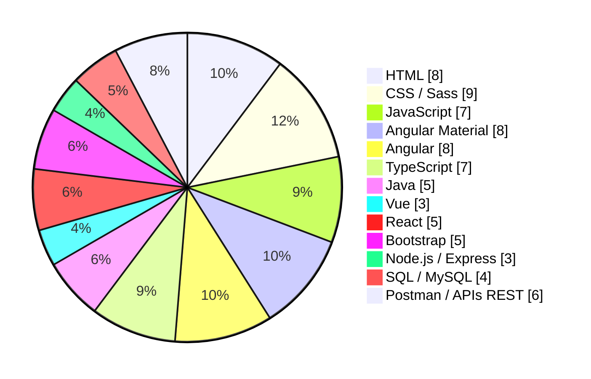
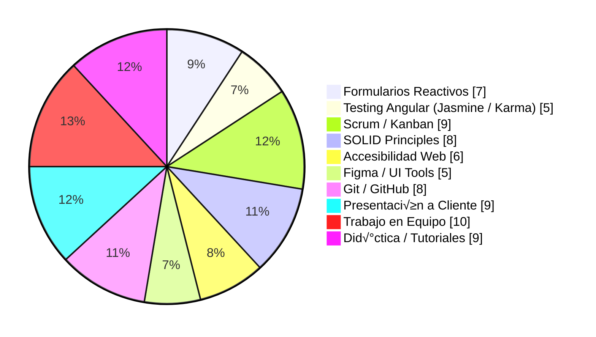
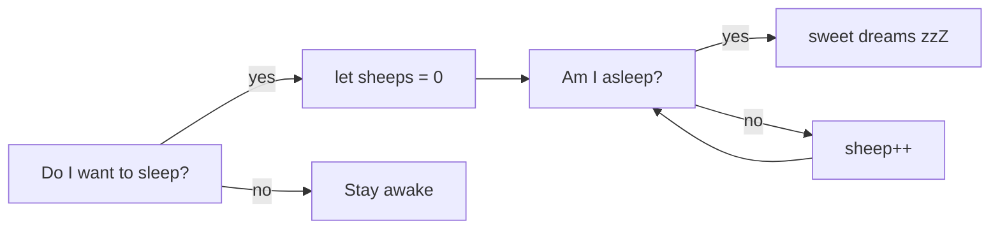

<h1 align="center">🌟 Marina González Suárez – Software Engineer</h1>
<p align="center">🧠 Curiosa, 🧩 autodidacta, 👩‍💻 full-stack web developer, y 💬 comunicadora nata.</p>

---

## 🌱 Sobre mí

- 💼 Soy **software engineer**, formada con más de **2000h de formación intensiva** en HTML, CSS/Sass, JavaScript, TypeScript y Angular.
- 🔧 Actualmente trabajo migrando una aplicación legacy de Java a SPA moderna con Angular actualizado siempre a la última versión y Java backend.
- 🤝 Me encanta el trabajo en equipo: siempre doy apoyo, tengo buen humor y me gusta enseñar a otros/as con tutoriales prácticos.
- 👁‍🗨 Desarrollo interfaces **accesibles, rápidas y mantenibles**, siguiendo buenas prácticas.

---

## 📊 Habilidades Técnicas


```mermaid
pie showData
    "HTML" : 8
    "CSS / Sass" : 9
    "JavaScript" : 7
    "Angular Material": 8
    "Angular" : 8
    "TypeScript" : 7
    "Java" : 5
    "Vue" : 3
    "React" : 5
    "Bootstrap" : 5
    "Node.js / Express" : 3
    "SQL / MySQL" : 4
    "Postman / APIs REST" : 6
```

---

## 🧠 Conocimientos Profesionales


```mermaid
pie showData
    "Formularios Reactivos" : 7
    "Testing Angular (Jasmine / Karma)" : 5
    "Scrum / Kanban" : 9
    "SOLID Principles" : 8
    "Accesibilidad Web" : 6
    "Figma / UI Tools" : 5
    "Git / GitHub" : 8
    "Presentación a Cliente" : 9
    "Trabajo en Equipo" : 10
    "Did√°ctica / Tutoriales" : 9
```

---

## 🏆 Premios

### Finalista Hackathon Full-Stack · Julio 2022 – Factoría F5

| Front End                                       | Back End                                                | Figma                                                                                     | Equipo                                                                                                                                                                                                                                                                                                                                              |
| ----------------------------------------------- | ------------------------------------------------------- | ----------------------------------------------------------------------------------------- | --------------------------------------------------------------------------------------------------------------------------------------------------------------------------------------------------------------------------------------------------------------------------------------------------------------------------------------------------- |
| [Repo](https://github.com/Yelose/hackathon2022) | [Repo](https://github.com/Yelose/hackathon2022-backend) | [Figma](https://www.figma.com/file/YAx91pA7TXsx38eBbMk90v/PETS-Marketplace?node-id=0%3A1) | [Adrián](https://github.com/adrianmoratilla), [Jesús](https://github.com/checkmyprojects), [Jordi](https://github.com/JordiGDavant), [María](https://github.com/MariangelicaCarvallo), [Mario](https://github.com/marioastur), [Marina](https://github.com/Yelose), [Sara](https://github.com/Saracode13), [Taoufik](https://github.com/taoufikL12) |

<details><summary>üéì Ver diploma</summary>
<br>

</details>

---

## 🎓 Formación

* **Bootcamp Full Stack – Factoría F5 (850h.)**
* **Diseño web avanzado: HTML5, CSS3, JS – Carval Formación (300h.)**
* **Angular Material (6h.)**
* **Marketing Online (30h.)**
* **Responsive Real World Websites (12h.)**

<details><summary>📄 Ver Diplomas</summary>

* 
* 
* 
* 

</details>

---

## üõ† Tools I work with

| Front End | Back End | Design & Organization | 
| :---:  |  :---:  |  :---: |
|  [](https://angular.io/) [](https://vuejs.org/guide/introduction.html) [](https://code.visualstudio.com/) [](https://sass-lang.com/documentation/)  [](https://git-scm.com)  [](https://getbootstrap.com/)  [](https://www.w3schools.com/js) [](https://www.w3schools.com/cssref/) [](https://www.w3schools.com/html)   | [](https://www.oracle.com/java/) [](https://www.php.net/)  [](https://dev.mysql.com/)  [](https://nodejs.org) [](https://expressjs.com/) [](https://learning.postman.com)  | [](https://github.com/) [](https://www.gimp.org/)  [](https://www.figma.com/)  [](https://www.gitkraken.com/)  |

---

## 🎮 Mini proyectos

* üé≤ [Dice game JS local multiplayer](https://github.com/Yelose/dice150)
* üß∞ [Ejercicios Bootcamp F5](https://yelose.github.io/f5exercises/)

---

## 💬 Contacto

[](https://linkedin.com/in/yelose)
üìß [marina@yelose.dev](mailto:marina@yelose.dev)

---

## 📍 Localización

<details><summary>üìç Location</summary>

```topojson
{
  "type": "FeatureCollection",
  "features": [
    {
      "type": "Feature",
      "properties": {
        "marker-color": "#7e7e7e",
        "marker-size": "medium",
        "marker-symbol": "star"
      },
      "geometry": {
        "type": "Point",
        "coordinates": [
          -5.636758804321289,
          43.287858704287586
        ]
      }
    },
    {
      "type": "Feature",
      "properties": {
        "stroke": "#555555",
        "stroke-width": 2,
        "stroke-opacity": 1
      },
      "geometry": {
        "type": "LineString",
        "coordinates": [
          [
            -1.7742919921875,
            43.389081939117496
          ],
          [
            -3.0157470703125,
            43.328174695525846
          ]
        ]
      }
    }
  ]
}
```

---

## 💤 Bonus Flowchart


```mermaid
flowchart LR
id1[Do I want to sleep?]--"yes"-->id2[let sheeps = 0]
id1--"no"-->id3[Stay awake]
id2-->id4[Am I asleep?]--"yes"-->id5[sweet dreams zzZ]
id4--"no"-->id6[sheep++ ]-->id4
```


